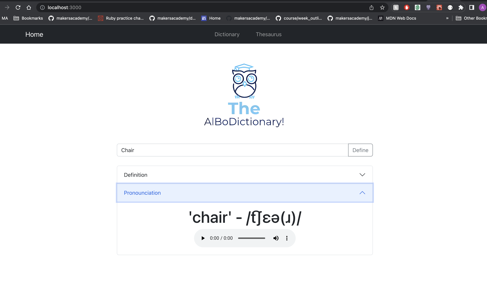

# AlBo Dictionary

## Why & What?

I wanted to create an app using React.js and Bootstrap. The latter of which I had not used before. This was a simple project, that allowed me to develop my understanding of React and to continue to build apps that rely on API requests. It is purposefully simple and clean in design, simply listing the definitions of words and providing the user the ability to hear the word be pronounced inside the app without having to go to a different location. This app also provides a Thesaurus function alongside the originally planned Dictionary function.

## Install and Run the Code

Navigate to root of project folder

```
npm install
```

Navigate to src folder

```
npm start
```

Navigate to api folder

```
npm start
```

Enjoy!

## Dependencies

- "@testing-library/jest-dom": "^5.16.5",
- "@testing-library/react": "^13.4.0",
- "@testing-library/user-event": "^13.5.0",
- "axios": "^1.3.4",
- "bootstrap": "^5.2.3",
- "react": "^18.2.0",
- "react-audio-player": "^0.17.0",
- "react-bootstrap": "^2.7.2",
- "react-dom": "^18.2.0",
- "react-scripts": "5.0.1",
- "web-vitals": "^2.1.4"

## Screenshots



